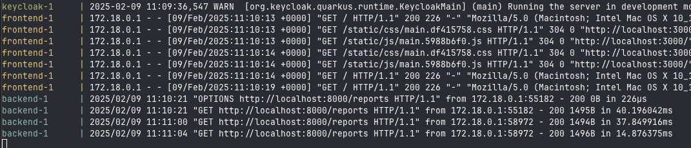

## Задание


Вам нужно улучшить безопасность приложения, заменив Code Grant на PKCE. Затем необходимо подготовить API для работы с отчётом.  

## Что нужно сделать

Реализуйте PKCE. Его нужно добавить к существующим приложениям — фронтенду и Keycloak. 
Мы специально не рассказывали в теории, как это сделать. Чтобы разобраться, изучите официальную документацию.
Создайте бэкенд-часть приложения для API. Выберите удобный для вас язык — Pyhton, Java, C# или любой другой. 
Добавьте API /reports в этот бэкенд для передачи отчётов. Тут не требуется поход в базы данных, 
ограничьтесь генерацией произвольных данных. Реализация сбора фактических данных будет в следующем задании.

## Решение

* Реализован бекенд на Go, логика авторизации вынесена в отдельный middleware

* В файле realm-export.json настроен PKCE

Запуск

```docker-compose up --build```


[Форма авторизации](http://localhost:3000/)

Логин: `prothetic1`

Пароль: `prothetic123`

Пример логов успешной работы бека при авторизации получения репорта с определенной ролью аутентифицировавшегося пользователя




